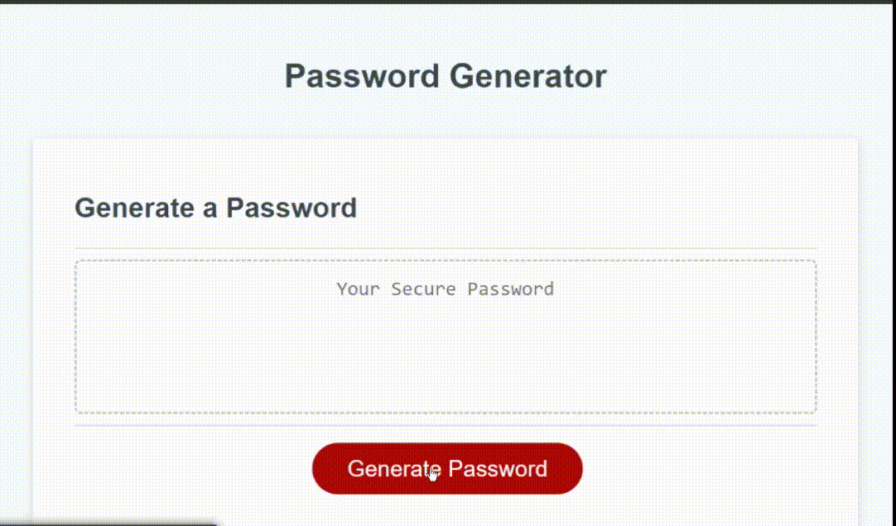

# Password Generator

## Description
In a digital age, where sensitive information is stored remotely, it is important to keep secure passwords in order to protect said information. This project has been created with the purpose of helping an user generate secure passwords based on certain criteria: the password length and character types. The output is a randomly generated password that the user can utilize to protect its information.

## Usage
When the user opens the app, they will see a text box and a "Generate Password" button. In order to create a password, the user need to click on the generate button, which will then open a series of prompts. Here, the user can specify the character length of the password, as well as selecting wether or not to include lowercase, uppercase, special characters and numbers. After all prompts, the newly generated password will be inserted in the text box area, where the user can copy it.

## Mock-Up

--- 

## Credits

- Starter Code by: Tec Bootcamp (https://github.com/coding-boot-camp/friendly-parakeet)
- Code by: Daniel Sanchez (https://github.com/Morkendi)

## Links
- Link to GitHub Pages: https://morkendi.github.io/challenge-3/
